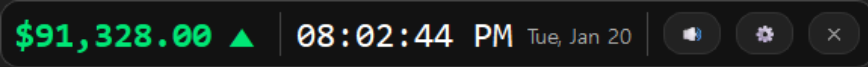
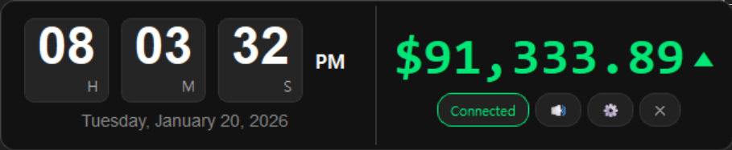
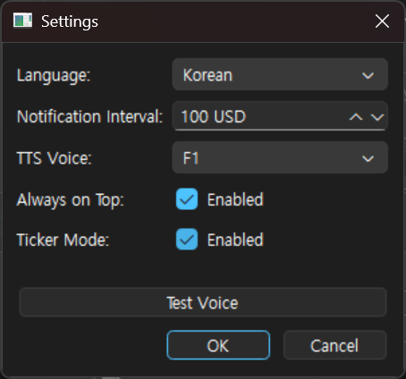

# BitTalker

Real-time Bitcoin price monitoring desktop app with voice alerts.


## Features

- 📈 **Real-time Price** - Binance WebSocket integration
- 🔊 **Voice Alerts** - AI TTS powered by [Supertonic](https://github.com/supertone-inc/supertonic) (5 languages)
- 💰 **Price Interval Alerts** - Get notified when price crosses configurable thresholds (e.g., every $50, $100)
- 🎨 **Dark Theme** - Modern UI with flip clock display
- 📐 **Layout Modes** - Ticker (compact) / Normal mode
- 💾 **Persistent Settings** - JSON-based configuration

## Screenshots

### Ticker Mode


### Normal Mode


### Settings


## Installation

```bash
# Clone
git clone https://github.com/yusulike/bittalker.git
cd bittalker

# Install dependencies
pip install -r requirements.txt

# Download TTS models (first time only)
python scripts/download_assets.py

# Run
python src/main.py
```

## Requirements

```
PyQt6>=6.6.0
websocket-client>=1.6.0
onnxruntime>=1.16.0
numpy>=1.24.0
soundfile>=0.12.0
requests>=2.31.0
```

## Configuration

Settings are saved in `settings.json`:

```json
{
  "interval": 100,
  "voice": "F1",
  "language": "Korean",
  "always_on_top": true,
  "muted": false,
  "ticker_mode": true
}
```

| Option | Description | Default |
|--------|-------------|---------|
| `interval` | Price alert interval in USD (e.g., 50, 100, 500) | `100` |
| `voice` | TTS voice style (F1-F5, M1-M5) | `"F1"` |
| `language` | Alert language | `"Korean"` |
| `always_on_top` | Keep window on top | `true` |
| `muted` | Mute voice alerts | `false` |
| `ticker_mode` | Use compact ticker mode | `true` |

## Supported Languages

| Language | Example Alert |
|----------|---------------|
| Korean | "구만 오천오백달러를 돌파했습니다" |
| English | "Bitcoin passed 95500 dollars" |
| Spanish | "Bitcoin superó los 95500 dólares" |
| Portuguese | "O Bitcoin ultrapassou 95500 dólares" |
| French | "Le Bitcoin a dépassé 95500 dollars" |

## Project Structure

```
bittalker/
├── src/
│   ├── main.py           # Entry point
│   ├── core/             # Business logic (price monitor, interval tracker)
│   ├── services/         # TTS service
│   ├── ui/               # PyQt6 UI components
│   └── utils/            # Utilities (settings, text processing)
├── assets/               # TTS models (ONNX)
├── cache/                # Audio cache (auto-generated)
├── docs/                 # Documentation
└── tests/                # Unit tests
```

## Credits

- **TTS Engine**: [Supertonic](https://github.com/supertone-inc/supertonic) by Supertone Inc.
  - Lightning-fast, on-device, multilingual TTS running natively via ONNX
  - ⭐ 2.4k+ stars | Supports 5 languages

## License

MIT License
