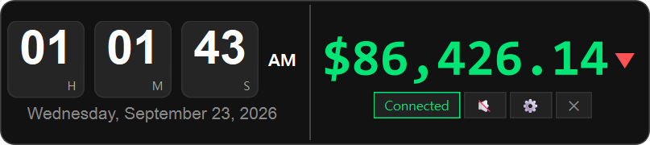
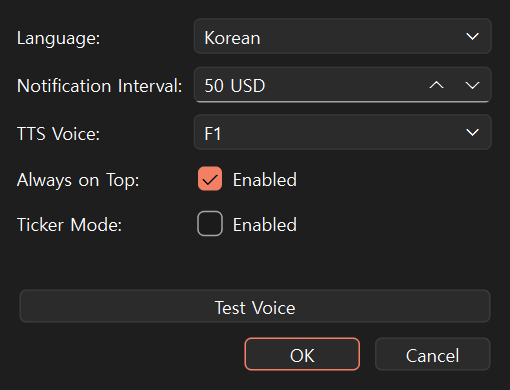

# BitTalker

Real-time Bitcoin price monitor with desktop UI and voice alerts.


## Overview

BitTalker is a lightweight Windows desktop app that tracks the live BTC/USDT price from Binance and announces price threshold crossings through local TTS audio. It is designed as a compact, always-on-top ticker that can also switch to a fuller normal layout for monitoring and settings.

## Features

- 📈 Real-time BTC price updates via Binance WebSocket
- 💰 Interval-based alerts such as $50, $100, $500, etc.
- 🔊 Local TTS alerts using Supertonic ONNX models
- 🌍 Multi-language notification text: Korean, English, Spanish, Portuguese, French
- 🎛️ Configurable voice style selection (`F1`-`F5`, `M1`-`M5`)
- 🕒 Compact ticker layout and full desktop layout modes
- ⚙️ Persistent settings saved to `settings.json`
- 🔇 Mute / unmute toggle and voice test support
- 💡 Hourly chime and moving price indicator (`▲` / `▼`)

## Screenshots

### Ticker mode


### Normal mode


### Settings dialog


## Requirements

- Windows 10/11
- Python 3.10+
- PyQt6 GUI runtime
- Audio output via `winsound` on Windows

### Python dependencies

```bash
pip install -r requirements.txt
```

Installed packages include:

```txt
PyQt6>=6.6.0
websocket-client>=1.6.0
onnxruntime>=1.16.0
numpy>=1.24.0
soundfile>=0.12.0
requests>=2.31.0
huggingface_hub>=0.25.0
```

## Quick Start

```bash
# 1) Clone the repo
git clone https://github.com/yusulike/bittalker.git
cd bittalker

# 2) Install dependencies
pip install -r requirements.txt

# 3) Download the ONNX model assets (first time only)
python scripts/download_assets.py

# 4) Run the app
python src/main.py
```

## Asset Setup

The app expects the TTS model bundle under the project `assets/` directory. The download script fetches the required Supertonic assets from Hugging Face and stores them in:

```text
assets/
├── onnx/
│   ├── duration_predictor.onnx
│   ├── text_encoder.onnx
│   ├── tts.json
│   ├── unicode_indexer.json
│   ├── vector_estimator.onnx
│   └── vocoder.onnx
├── voice_styles/
│   ├── F1.json
│   ├── F2.json
│   └── ...
```

If assets are missing, the app will log a warning and fall back to a generated dummy audio file rather than crashing.

## Configuration

Current settings are stored in the project root `settings.json`.

```json
{
  "interval": 50,
  "voice": "F1",
  "language": "Korean",
  "always_on_top": true,
  "muted": false,
  "ticker_mode": false
}
```

| Key | Description | Default |
|------|-------------|---------|
| `interval` | Alert threshold in USD | `50` |
| `voice` | Voice style (`F1`-`F5`, `M1`-`M5`) | `"F1"` |
| `language` | Notification language | `"Korean"` |
| `always_on_top` | Keep the window floating above other apps | `true` |
| `muted` | Disable voice playback | `false` |
| `ticker_mode` | Use compact ticker layout | `false` |

## Supported Languages

The app currently supports the following announcement languages:

| Language | Example |
|----------|---------|
| Korean | "구만 오천오백달러를 돌파했습니다." |
| English | "Bitcoin passed 95500 dollars." |
| Spanish | "Bitcoin superó los 95500 dólares." |
| Portuguese | "O Bitcoin ultrapassou 95500 dólares." |
| French | "Le Bitcoin a dépassé 95500 dollars." |

## Architecture

```text
bittalker/
├── src/
│   ├── main.py                    # App entry point and DPI setup
│   ├── core/
│   │   ├── price_monitor.py       # Binance WebSocket client
│   │   └── interval_logic.py      # Threshold crossing logic
│   ├── services/
│   │   ├── helper.py              # ONNX inference wrapper
│   │   └── tts_service.py         # Audio generation and playback
│   ├── ui/
│   │   ├── clock_widget.py        # Flip clock widget
│   │   ├── main_window.py         # Main PyQt UI controller
│   │   └── settings_dialog.py     # Settings UI
│   └── utils/
│       ├── korean_numbers.py      # Korean number formatting for speech
│       └── settings_manager.py    # JSON settings persistence
├── assets/                        # Supertonic model and voice style assets
├── cache/                         # Generated voice cache files
├── docs/                          # Screenshots and design notes
├── scripts/
│   ├── check_sig.py
│   ├── check_sig_save.py
│   ├── download_assets.py
│   └── ...
├── tests/
│   ├── test_interval.py
│   └── test_settings_tts.py
├── settings.json                  # User settings
├── requirements.txt               # Python dependencies
├── LICENSE                        # MIT License
├── README.md
└── debug_ws.py
```

## Data Flow

1. `PriceMonitor` connects to Binance WebSocket and emits fresh BTC prices.
2. `MainWindow` updates the price label and direction indicator.
3. `IntervalTracker` checks whether the price crossed the configured threshold.
4. When a crossing occurs, the app builds a localized announcement string and calls `TTSService`.
5. The speech engine loads a cached audio file if available, otherwise generates one from the ONNX model.
6. Playback happens locally through Windows audio output.

## Notes

- The app is intentionally Windows-focused because it uses `winsound` for direct audio playback.
- Default settings are created automatically on first launch if `settings.json` does not exist.
- The TTS model assets are downloaded separately; without them, the app still starts but voice output is limited to a fallback sound.
- The price logic is designed to catch boundary crossings even when the market jumps across multiple intervals in one tick.

## Credits

- TTS engine: [Supertonic 3](https://github.com/supertone-inc/supertonic)
- Model source: [Supertone/supertonic-3](https://huggingface.co/Supertone/supertonic-3)
- UI and app logic: custom PyQt6 desktop implementation

## License

MIT License
